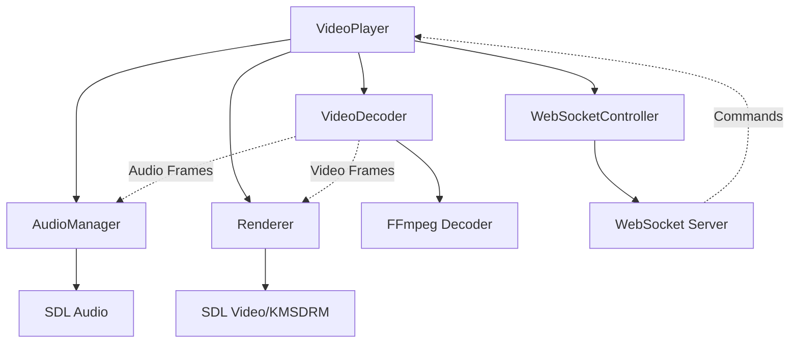
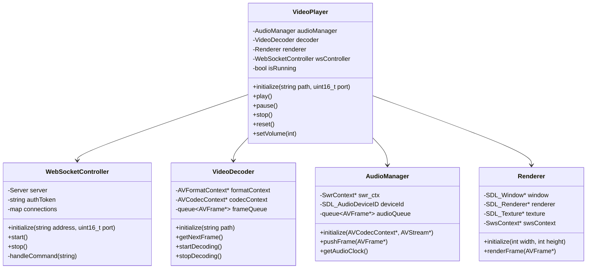

# 4K Video Player for Raspberry Pi 4

A high-performance video player optimized for Raspberry Pi 4 Model B, capable of playing 4K videos with audio/video synchronization and WebSocket control.

Perfect for permanent installations on Raspberry Pi 4 (video mapping, digital signage, interactive displays)

<div align="center">

[](https://github.com/benoitliard/video-player/stargazers)
[](https://github.com/benoitliard/video-player/network/members)
[](https://github.com/benoitliard/video-player/issues)
[](https://github.com/benoitliard/video-player/blob/main/LICENSE)

</div>

## 🚀 Features

- 4K video playback with hardware acceleration via KMSDRM
- Precise audio/video synchronization (±10ms)
- Optimized multi-threaded decoding
- Supported codecs:
  - H.264/AVC
  - H.265/HEVC
  - AAC (audio)
- Smart audio/video buffer management
- Integrated logging system
- M3U playlist support with automatic looping
- Clean signal handling (Ctrl+C)
- Remote control via WebSocket
- Backend telemetry integration (device IP + error logs)
- Orientation file watcher for runtime display rotation

## 🎮 WebSocket Control

Remote control via WebSocket (default port 9002). Available commands:

```json
{"token": "your_token", "command": "play"}
{"token": "your_token", "command": "pause"}
{"token": "your_token", "command": "stop"}
{"token": "your_token", "command": "reset"}
{"token": "your_token", "command": "volume", "value": 50}
{"token": "your_token", "command": "status"}
```

Authentication token is generated at startup and displayed in logs. You can override it
with the `KIOSK_WS_TOKEN` environment variable.

## Integration With Kiosk Platform

The player now supports project-level backend and device integrations:

- Reports kiosk IP to `/api/device/<serial>/ip`
- Reports runtime errors to `/api/device/<serial>/error-log`
- Pulls orientation from `/api/device/<serial>/orientation`
- Pulls playlist content from `/api/device/<serial>/playlist`
- Watches an orientation file and applies rotation live (0, 90, 180, 270)
- Reads playlist files in M3U/M3U8 format used by the web panel

Environment variables:

- `KIOSK_PLAYBACK_SOURCE`: media file or `.m3u/.m3u8` playlist path
- `KIOSK_BACKEND_URL` or `BACKEND_BASE_URL`: backend base URL, e.g. `http://10.0.0.10:5000`
- `KIOSK_SERIAL_NUMBER`: explicit device serial (optional, auto-detected when missing)
- `KIOSK_HEARTBEAT_SECONDS`: interval for IP reporting (default: `60`)
- `KIOSK_BACKEND_SYNC_SECONDS`: backend pull interval for orientation/playlist (default: `10`)
- `KIOSK_RUNTIME_PLAYLIST_FILE`: local runtime playlist cache path (default: `/tmp/kiosk_playlist_runtime.m3u`)
- `KIOSK_ORIENTATION_FILE`: orientation file path (default: `/storage/kiosk_orientation.txt`)
- `KIOSK_WS_PORT`: WebSocket control port (default: `9002`)
- `KIOSK_WS_TOKEN`: fixed WebSocket auth token (optional)

## 📋 Requirements

### Hardware
- Raspberry Pi 4 Model B
- Minimum 4GB RAM recommended for 4K playback
- HDMI display capable of the target resolution

### Dependencies
```bash
sudo apt-get update
sudo apt-get install -y \
    build-essential \
    cmake \
    libboost-all-dev \
    libwebsocketpp-dev \
    libjsoncpp-dev \
    libssl-dev \
    zlib1g-dev \
    libcurl4-openssl-dev \
    libsdl2-dev \
    libavcodec-dev \
    libavformat-dev \
    libavutil-dev \
    libswscale-dev \
    libswresample-dev
```

## 🛠️ Build

```bash
mkdir build
cd build
cmake ..
make -j4
```

## 📦 Usage

The binary accepts either a direct media file or a playlist path:

```bash
./video_player /storage/videos/kiosk_playlist.m3u
```

You can also run without argument if `KIOSK_PLAYBACK_SOURCE` is set.

## 🚀 Performance

- 4K H.264 decoding on Pi 4 is supported, but 1080p is the safer default for sustained playback
- Audio latency < 50ms
- CPU usage depends on codec and resolution; use H.264 for broad compatibility
- RAM usage depends on playlist length and buffering
- A/V sync: ±10ms

## 🤝 Contributing

Contributions are welcome! Here are some priority areas for improvement:

1. Additional RPi 4 optimizations
2. Support for more codec formats
3. UI improvements
4. Documentation translations

Please read our [Contributing Guidelines](CONTRIBUTING.md) before submitting a PR.

## 📊 Benchmarks

<details>
<summary>View detailed performance metrics</summary>

| Resolution | Codec  | FPS | CPU Usage | RAM Usage |
|------------|--------|-----|-----------|-----------|
| 4K (2160p) | H.264  | varies | varies   | varies    |
| 1080p      | H.264  | high   | moderate | moderate  |

</details>

## 🏗️ Architecture



## 📊 Class Diagram




## 📝 License

This project is licensed under the MIT License - see the [LICENSE](LICENSE) file for details.

## 🌟 Show your support

Give a ⭐️ if this project helped you!

---

<div align="center">
Made with ❤️ for the Raspberry Pi community
</div>

## 📧 Contact

- GitHub: [@benoitliard](https://github.com/benoitliard)


